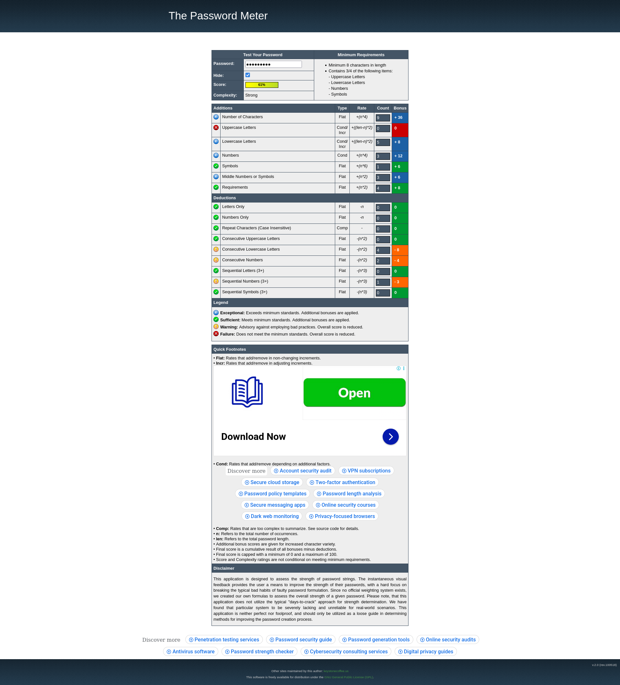
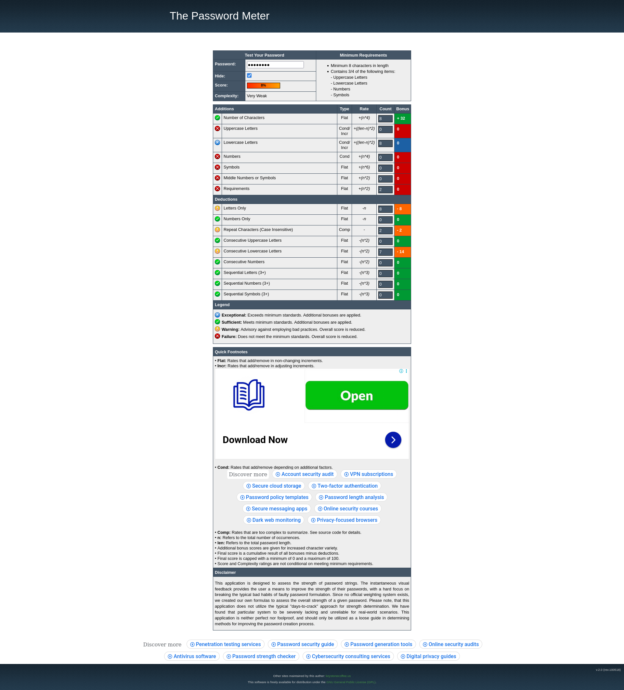
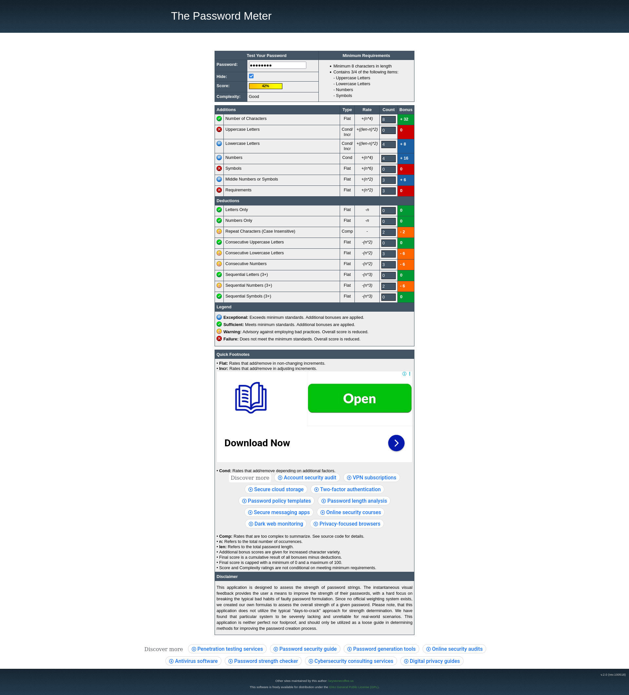
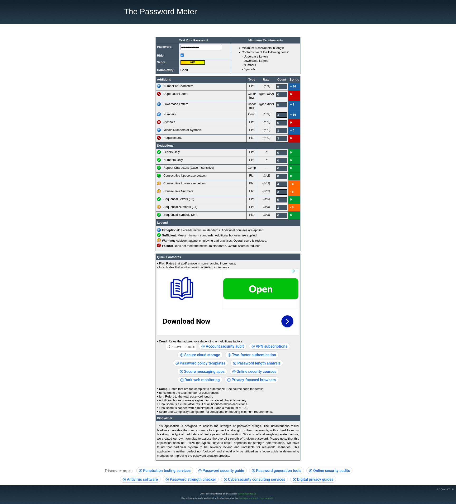
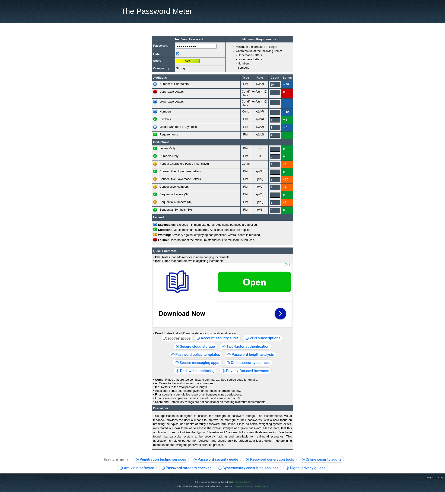
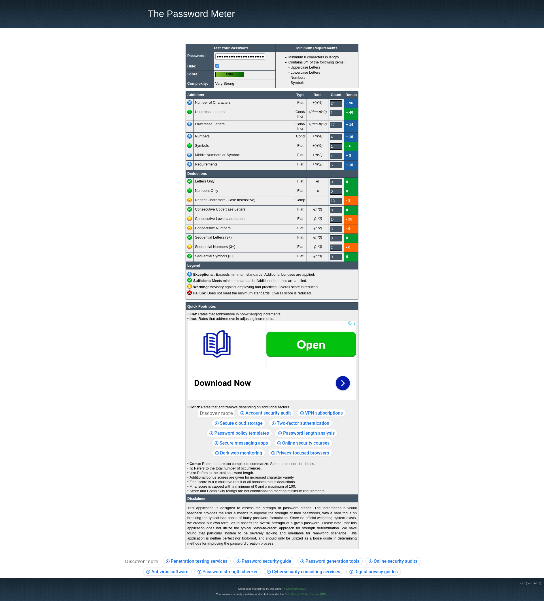

### Example: "12345678"
See screenshot: 

### Example: "admin@123"
See screenshot: 

### Example: "admin"
See screenshot: 

### Example: "password"
See screenshot: 

### Example: "pass1234"
See screenshot: 

### Example: "admin1234"
See screenshot: 

### Example: "secure@123"
See screenshot: 

### Example: "welcome"
See screenshot: 

### Example: "Org_secure@987"
See screenshot: 

### Example: "Pattern_log@2003"
See screenshot: 

### Example: "Common_enter@thepass1234"
See screenshot: 

### Example: "Zero0000@1234"
See screenshot: 
